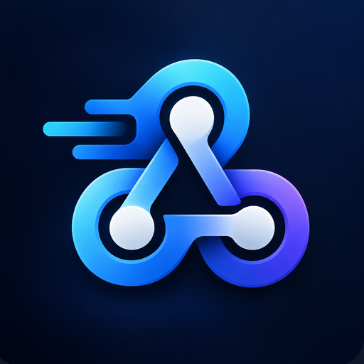

<p align="center">
  
</p>

<h1 align="center">RelayHook</h1>

<p align="center">
  Reliable outbound webhooks for ASP.NET Core, backed by SQL Server.
</p>

RelayHook is a .NET library for applications that need to send HTTP callbacks reliably.

Instead of sending a webhook directly and hoping the request succeeds, RelayHook stores it in your application's SQL Server database and delivers it in the background. Failed deliveries can be retried automatically, and queued callbacks survive application restarts.

There is no separate RelayHook service to deploy and no message broker required.

## Features

- Persistent callback queue backed by SQL Server
- Background delivery using an ASP.NET Core hosted service
- Automatic retries with jitter and `Retry-After` support
- Crash recovery using renewable leases
- Safe execution across multiple application instances
- API Key, Basic, Bearer, JWT and OAuth2 Client Credentials authentication
- Transactional enqueue using an existing `SqlConnection` and `SqlTransaction`
- Stable callback and idempotency identifiers across retries
- Health checks, structured logging, metrics and tracing
- Bounded payload and response storage
- HTTPS and destination security checks by default

## Installation

For the standard ASP.NET Core + SQL Server setup:

```bash
dotnet add package RelayHook
```

RelayHook targets **.NET 10**.

The individual `RelayHook.Core`, `RelayHook.Authentication`, `RelayHook.SqlServer` and `RelayHook.AspNetCore` packages are also available if you need a custom composition.

## Quick start

Add a SQL Server connection string:

```json
{
  "ConnectionStrings": {
    "RelayHook": "Server=localhost;Database=App;Integrated Security=true;TrustServerCertificate=true"
  }
}
```

Register RelayHook and configure a destination:

```csharp
builder.Services
    .AddRelayHook()
    .UseSqlServer(builder.Configuration.GetConnectionString("RelayHook")!)
    .AddClient("PartnerA", client =>
    {
        client.AddEndpoint("primary", endpoint =>
        {
            endpoint.Url = new Uri("https://partner.example.com/webhooks");
            endpoint.UseNoAuthentication();
        });
    });

builder.Services.AddRelayHookHealthCheck();
```

Then inject `ICallbackClient` wherever you need to send a callback:

```csharp
using RelayHook.Core.Abstractions;

public sealed class PaymentService(ICallbackClient callbacks)
{
    public Task<Guid> NotifyAsync(
        Guid paymentId,
        CancellationToken cancellationToken)
    {
        return callbacks.EnqueueAsync(
            "PartnerA",
            "payment.completed",
            new
            {
                PaymentId = paymentId,
                Status = "Completed"
            },
            cancellationToken);
    }
}
```

`EnqueueAsync` persists the callback and returns. Delivery happens in the background.

RelayHook creates and maintains its own `[Callback]` schema in the configured database. It does not add entities to your application's `DbContext` or migrations.

## Idempotency

RelayHook provides **at-least-once delivery**.

In some failure scenarios a remote endpoint can receive the same callback more than once. This can happen, for example, when the receiver accepts a request but the application stops before RelayHook records the successful delivery.

For operations where duplicates matter, provide an idempotency key:

```csharp
await callbacks.EnqueueAsync(
    "PartnerA",
    "payment.completed",
    payload,
    new CallbackEnqueueOptions
    {
        CorrelationId = paymentId.ToString("N"),
        IdempotencyKey = $"payment-{paymentId:N}"
    },
    cancellationToken);
```

The callback ID and idempotency key remain stable across retries.

Receivers should use one of these values to detect duplicate deliveries.

## Authentication

RelayHook supports:

- No authentication
- API Key
- Basic authentication
- Static Bearer tokens
- Generated HS256 JWT
- OAuth2 Client Credentials
- Custom authenticators

Secrets are referenced by configuration key rather than stored with callback jobs.

For example:

```csharp
endpoint.UseApiKey(authentication =>
{
    authentication.HeaderName = "X-API-Key";
    authentication.SecretReference = "Callbacks:PartnerA:ApiKey";
});
```

The default secret provider reads from `IConfiguration`, so the actual value can come from environment variables or any configuration provider used by your application.

For production environments, secrets can be supplied through systems such as Azure Key Vault, HashiCorp Vault, CyberArk or Kubernetes Secrets.

See the [authentication documentation](https://github.com/iuliansilitra/relay-hook/blob/main/RelayHook/docs/authentication.md) for the available authentication methods.

## Retries

By default, RelayHook retries transient failures after approximately:

```text
1 minute
5 minutes
15 minutes
1 hour
```

with jitter applied to the delay.

Retries are performed for network failures, timeouts, HTTP `408`, `425`, `429` and `5xx` responses.

`Retry-After` is respected when supplied by the remote server.

The default maximum number of delivery attempts is **5**.

See [reliability](https://github.com/iuliansilitra/relay-hook/blob/main/RelayHook/docs/reliability.md) for more details.

## Transactional enqueue

If your business data and RelayHook use the same SQL Server database, a callback can be inserted using an existing SQL transaction:

```csharp
var callbackId = await transactionalCallbacks.EnqueueAsync(
    connection,
    transaction,
    "PartnerA",
    "payment.completed",
    payload,
    cancellationToken: cancellationToken);
```

This allows the business operation and callback enqueue to commit or roll back together.

RelayHook does not commit or roll back the transaction supplied by the application.

## Running multiple instances

Multiple instances of the same application can safely use the same RelayHook database.

Jobs are claimed atomically and protected by renewable leases. If an instance stops while processing a callback, the job can be recovered by another instance after its lease expires.

This makes RelayHook suitable for applications running multiple replicas or Kubernetes pods without requiring a separate coordinator.

## Observability

RelayHook integrates with standard .NET observability APIs and provides:

- structured `ILogger` events
- `System.Diagnostics.ActivitySource` tracing
- `System.Diagnostics.Metrics`
- ASP.NET Core health checks

Register the health check with:

```csharp
builder.Services.AddRelayHookHealthCheck();
```

The registered health check is named `relayhook`.

## Security

RelayHook requires HTTPS destinations by default.

Redirects are disabled, and private, loopback and link-local literal addresses are blocked unless explicitly allowed.

Resolved authentication secrets are not stored with callback jobs and are not written to RelayHook logs.

For production deployment guidance, see [security](https://github.com/iuliansilitra/relay-hook/blob/main/RelayHook/docs/security.md).

## Documentation

More detailed documentation is available in the repository:

- [Configuration](https://github.com/iuliansilitra/relay-hook/blob/main/RelayHook/docs/configuration.md)
- [Authentication](https://github.com/iuliansilitra/relay-hook/blob/main/RelayHook/docs/authentication.md)
- [Database](https://github.com/iuliansilitra/relay-hook/blob/main/RelayHook/docs/database.md)
- [Reliability](https://github.com/iuliansilitra/relay-hook/blob/main/RelayHook/docs/reliability.md)
- [Security](https://github.com/iuliansilitra/relay-hook/blob/main/RelayHook/docs/security.md)
- [Troubleshooting](https://github.com/iuliansilitra/relay-hook/blob/main/RelayHook/docs/troubleshooting.md)
- [Architecture](https://github.com/iuliansilitra/relay-hook/blob/main/RelayHook/docs/architecture.md)

## License

RelayHook is available under the [MIT License](https://github.com/iuliansilitra/relay-hook/blob/main/LICENSE).