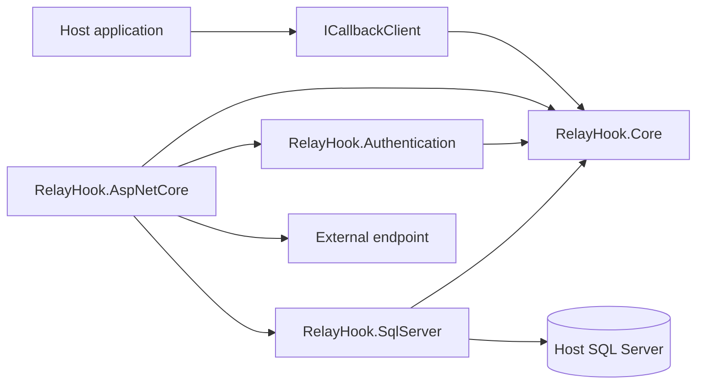
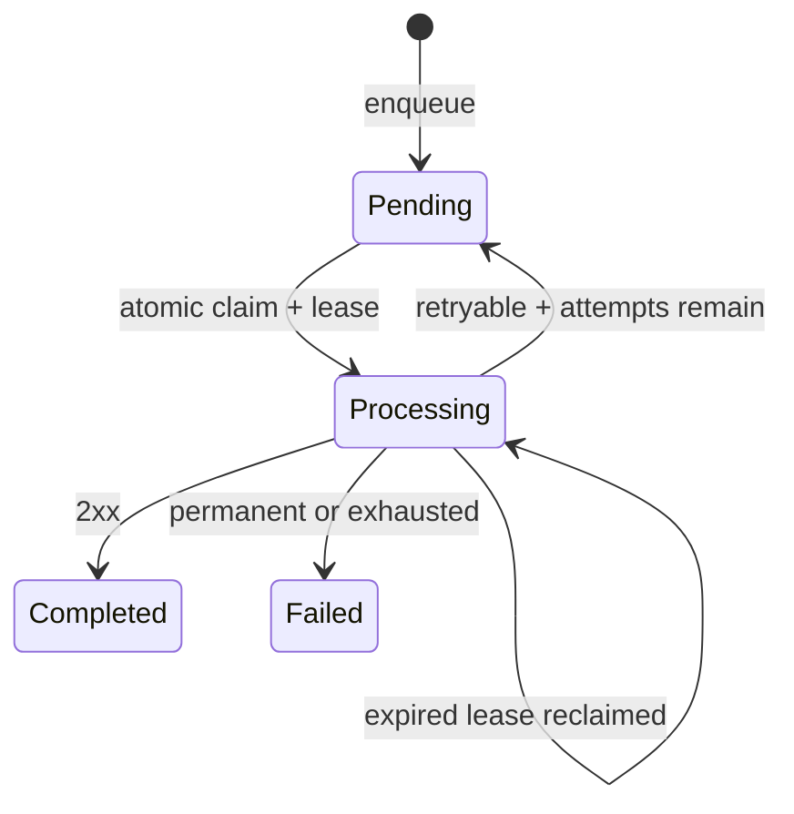

# Architecture

RelayHook is an embedded durable callback engine. Each ASP.NET Core host owns its callback records in the host's SQL Server database. RelayHook is not a central service.

## Boundaries

- `RelayHook.Core` owns public contracts, immutable delivery snapshots, retry policy, and serialization. It has no SQL Server or hosting dependency.
- `RelayHook.Authentication` owns authentication strategies and OAuth token caching. It depends only on Core and framework abstractions.
- `RelayHook.SqlServer` adapts Core storage ports to SQL Server. It owns schema installation, upgrades, atomic claims, leases, attempts, and retention.
- `RelayHook.AspNetCore` is the composition root. It owns DI, configuration builders, hosted processing, HTTP transport, logging, diagnostics, URL policy, and health checks.

The project names follow the repository's RelayHook product name rather than the prompt's illustrative `CallbackEngine` name. The proposed four boundaries remain unchanged.



## Public API

`AddRelayHook` registers the engine. `UseSqlServer` selects durable storage. `AddClient` creates a logical client with one or more named endpoints. Business code only needs `ICallbackClient`; advanced callers can use `ICallbackTransactionalClient` with an existing `DbConnection` and `DbTransaction`.

Enqueue selects a named endpoint, serializes immediately, validates payload size and URL policy, snapshots all non-secret delivery settings, resolves stable SQL identities, and inserts one job. It never sends HTTP.

## Dependency graph

```text
RelayHook.AspNetCore -> RelayHook.Authentication -> RelayHook.Core
                    -> RelayHook.SqlServer ------> RelayHook.Core
                    -> RelayHook.Core
```

## Processing lifecycle



Before network I/O, RelayHook inserts an attempt and increments `AttemptCount`. A crash therefore leaves an auditable incomplete attempt. `CompletedAttemptCount` advances only when the attempt result and job transition commit together, so incomplete crash attempts do not consume the retry budget. Lease expiry makes the job recoverable. Each completion is conditional on the worker still owning the lease.

## Important decisions

- Delivery is at least once. Receiver idempotency is required.
- SQL access uses `Microsoft.Data.SqlClient`; no host `DbContext` changes or host migrations are required.
- Configuration is hybrid. Current logical clients/endpoints live in application configuration and stable identities live in SQL. Every job stores an exact non-secret endpoint snapshot.
- Payloads are serialized at enqueue time so later model or serializer changes cannot alter queued work.
- Redirects are disabled to prevent credential forwarding across hosts.
- Built-in JWT support uses HS256. Certificate signing can be added as another authenticator without changing Core.
- Failed-job retention is disabled by default. Operators must opt in before failed records are deleted.
- Dashboard and replay UI are non-goals for this release; schema keeps data needed by a future package.

See [database.md](database.md), [reliability.md](reliability.md), [authentication.md](authentication.md), and [security.md](security.md).
